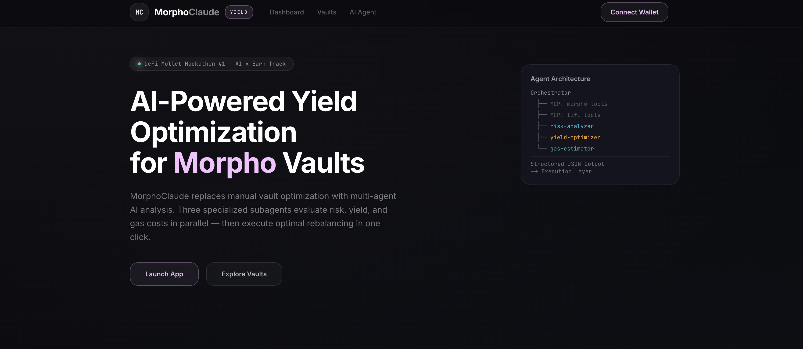

# MorphoClaude

AI-powered DeFi yield optimizer for Morpho Vaults, built with Claude Agent SDK for the [DeFi Mullet Hackathon #1](https://github.com/brucexu-eth/defi-mullet-hackathon) (AI x Earn track).



## What it does

MorphoClaude acts as an AI-driven fund allocator that analyzes Morpho USDC vaults across Ethereum and Base, then recommends and executes optimal rebalancing strategies. It replaces manual optimization workflows with multi-agent AI analysis covering risk, yield, and gas costs.

## Architecture

```
User Wallet
    |
Frontend Dashboard (Next.js 16 + shadcn/ui)
    |
Backend API Routes
    |--- Claude Agent SDK Orchestrator
    |       |--- MCP Server: morpho-tools (vault data, allocations, positions)
    |       |--- MCP Server: lifi-tools (vault discovery, deposit quotes, portfolio)
    |       |--- Subagent: risk-analyzer
    |       |--- Subagent: yield-optimizer
    |       |--- Subagent: gas-estimator
    |       |--- Structured JSON Output
    |
Blockchain (Ethereum / Base)
```

- **Data Layer**: Morpho GraphQL API + LI.FI Earn API for vault data and user positions
- **AI Layer**: Claude Agent SDK with MCP tools for on-demand data fetching, 3 specialized subagents, and structured output validation
- **Execution Layer**: ERC-4626 withdrawals via viem + LI.FI Composer deposit quotes

## Tech Stack

- Next.js 16.1.1 / React 19.2 / TypeScript
- @anthropic-ai/claude-agent-sdk + zod v4
- shadcn/ui + Tailwind CSS v4
- wagmi + viem (wallet + blockchain)
- @apollo/client (Morpho GraphQL)
- recharts (data visualization)

## Getting Started

```bash
npm install
cp .env.example .env.local
# Fill in your API keys
npm run dev
```

## Environment Variables

| Variable | Required | Description |
|---|---|---|
| `ANTHROPIC_API_KEY` | Yes | Claude Agent SDK |
| `LIFI_API_KEY` | Yes | LI.FI Composer quotes ([portal.li.fi](https://portal.li.fi)) |
| `NEXT_PUBLIC_ALCHEMY_KEY` | No | RPC provider |
| `NEXT_PUBLIC_WALLETCONNECT_PROJECT_ID` | No | WalletConnect |

## How it works

1. **Connect wallet** — view current Morpho vault positions and weighted APY
2. **Select risk profile** — conservative, balanced, or aggressive
3. **AI analysis** — the orchestrator dispatches risk-analyzer, yield-optimizer, and gas-estimator subagents in parallel, using MCP tools to fetch real-time vault and market data
4. **Review recommendation** — see proposed allocation, expected APY increase, risk score change, gas cost, and break-even period
5. **One-click execution** — atomic cross-vault rebalancing via ERC-4626 withdraw + LI.FI Composer deposit

## License

MIT
